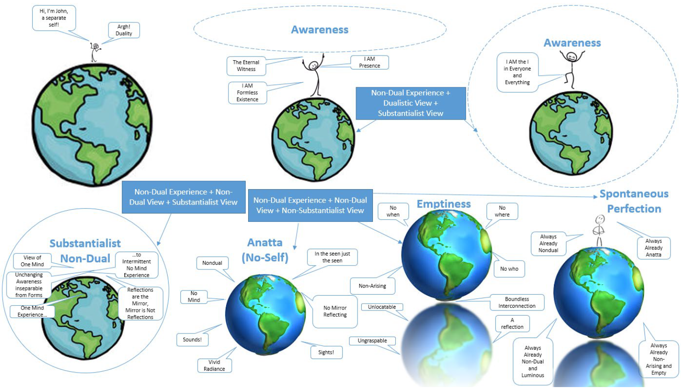

# Table of Contents
1. [Where to Start](#where-to-start)
2. [How to Contemplate](#how-to-contemplate)
3. [Visual Diagram of the Seven Stages](#visual-diagram)
3. [Stage 1: I AM / Eternal Witness](#stage1)
4. [Stage 2: I AM Everything](#stage2)
5. [Stage 3: Entering into Nothingness](#stage3)
6. [Stage 4: Presence as Mirror Bright Clarity](#stage4)
7. [Stage 5: No Mirror Reflecting (“Anatta / No-Self / Firstfold Emptiness”)](#stage5)
8. [Stage 6: The Nature of Presence is Empty (“Sunyata / Secondfold Emptiness”)](#stage6)
9. [Stage 7: Presence is Spontaneously Perfected](#stage7)
10. [Additional Materials](#additional-materials)

# Where to Start 

If you haven't already, first refer to the [Awakening to Reality blog](http://awakeningtoreality.blogspot.com/) and go through the 'Must Reads'. Next, reading the free E-Books is highly recommended:
- Awakening to Reality: A Guide to the Nature of Mind
- Soh’s Journal and Notes on Spiritual Awakening

This page is intended as a quick reference guide for those who are already familiar with the stages.

[Thusness' Vipassana](https://awakeningtoreality.blogspot.com/2018/12/thusnesss-vipassana.html) can be practised at any stage along with the self-inquiry/contemplations.

For discussions, you are welcome to join the [Awakening to Reality Facebook group](https://www.facebook.com/groups/AwakeningToReality/).

# How to Contemplate 

Let the contemplation/inquiry flow naturally. Don't let it become a repetitive verbal mantra. Instead, it should be treated as an investigation. Avoid trying to find an answer through logic, or dwelling in conceptual answers - it should be an experiential exercise. When doing self-inquiry, allow the doubt to build up and drive the inquiry.

> The doubt is itself the inquisitiveness and curiosity (an important key element to successful self-enquiry - otherwise the thought 'Who am I?' will just be a monotonous and robotic mental chanting like a mantra rather than lead the mind to the Source) to really find out the truth of your Being. You have to ask "Who am I?" like you really, really mean it, like you really, really want to find out what you truly are at the core of your Being and unlock the secret of Existence. Like, what the hell, after all these years living on this planet, what is at the core of this wondrous Life itself? What is this Existence? What am I??? I've seen many things in life and lived for so many years, but WHO is living this Life? Who is seeing, hearing, smelling? Who is dragging this corpse along? That's the meaning of doubt, nothing else.

# Visual Diagram of the Seven Stages 

# Stage 1: I AM / Eternal Witness 

## Self-Inquiry

- "Who am I?"
- "Before birth, who am I?"
- "Who / what am I beyond name and form?"
- "Who is dragging this corpse along?"
- "Who hears and who sees?"

# Stage 2: I AM Everything 

## Contemplation

- “Where does awareness end and manifestation begin?”
- “Is there a border/dividing line between awareness and manifestation?”

### Four aspects of I AM

- Impersonality
- Intensity of luminosity
- Dissolving the need to return or abide in I AM
- Effortlessness

# Stage 3: Entering into Nothingness 

## Dropping

- Drop away everything (knowledge, mind, body, etc).

# Stage 4: Presence as Mirror Bright Clarity 

## Contemplation

- Meditation and contemplation on [Bahiya Sutta](#bahiya-sutta)
- Contemplation on [Thusness Stanzas](#thusness-stanzas)
- “Is there a border/dividing line between awareness and manifestation?”
- “Where does awareness end and manifestation begin?”

- ### Four aspects of I AM

## Investigation
- Challenging inside/outside, subject/object dichotomy
- Investigating seamless awareness and manifestation

# Stage 5: No Mirror Reflecting (“Anatta / No-Self / Firstfold Emptiness”) 

## Contemplation

- Meditation and contemplation on [Bahiya Sutta](#bahiya-sutta)
- Contemplation on [Thusness Stanzas](#thusness-stanzas)

## Investigation

- Investigate and challenge all sense of awareness being unchanging and independent

# Stage 6: The Nature of Presence is Empty (“Sunyata / Secondfold Emptiness”) 

## Total Exertion (+A)

### Contemplation

> When you cook, there is no self that cooks, only the activity of cooking. The hands moves, the utensils act, the water boils, the potatoes peels… here there is no room for simplicity or complications, the “kitchen” went beyond its own imputation and dissolved into the activity of cooking and the universe is fully engaged in this cooking.

- Contemplate "not meeting yet connected" of total exertion and dependent origination
- Contemplation on the totality of each activity

## Emptiness (-A)

### Contemplation

- Contemplation on the ‘Where’ of phenomena
- "This moment ceases as it arises, is this moment arising or ceasing?”
- "30 years of practice and 23 years of kitchen life is like a passing thought. How heavy is this thought? The whereabouts of this thought? Taste the nature of this thought. It never truly arises." - John Tan, 2013
- “Appreciate the vivid, lurid scenery in non-dual and ask, Where is this scenery?” – John Tan, 2016

# Stage 7: Presence is Spontaneously Perfected 

## Contemplation

>Anatta is a seal, not a stage.\
>Awareness has always been non-dual.\
>Appearances have always been Non-arising.\
>All phenomena are ‘interconnected’ and by nature Maha.\
>All are always and already so.

# Additional Materials 

## Bahiya Sutta 

> Then, Bāhiya, you should train yourself thus:\
> In reference to the seen, there will be only the seen.\
> In reference to the heard, only the heard.\
> In reference to the sensed, only the sensed.\
> In reference to the cognized, only the cognized.\
> That is how you should train yourself.\
> When for you there will be only the seen in reference to the seen,\
> only the heard in reference to the heard,\
> only the sensed in reference to the sensed,\
> only the cognized in reference to the cognized,\
> then, Bāhiya, there is no you in connection with that.\
> When there is no you in connection with that,\
> there is no you there.\
> When there is no you there, you are neither here nor yonder nor between the two.\
> This, just this, is the end of stress.

## Thusness Stanzas 

### Stanza 1
> There is thinking, no thinker\
> There is hearing, no hearer\
> There is seeing, no seer

### Stanza 2
> In thinking, just thoughts\
> In hearing, just sounds\
> In seeing, just forms, shapes and colors
